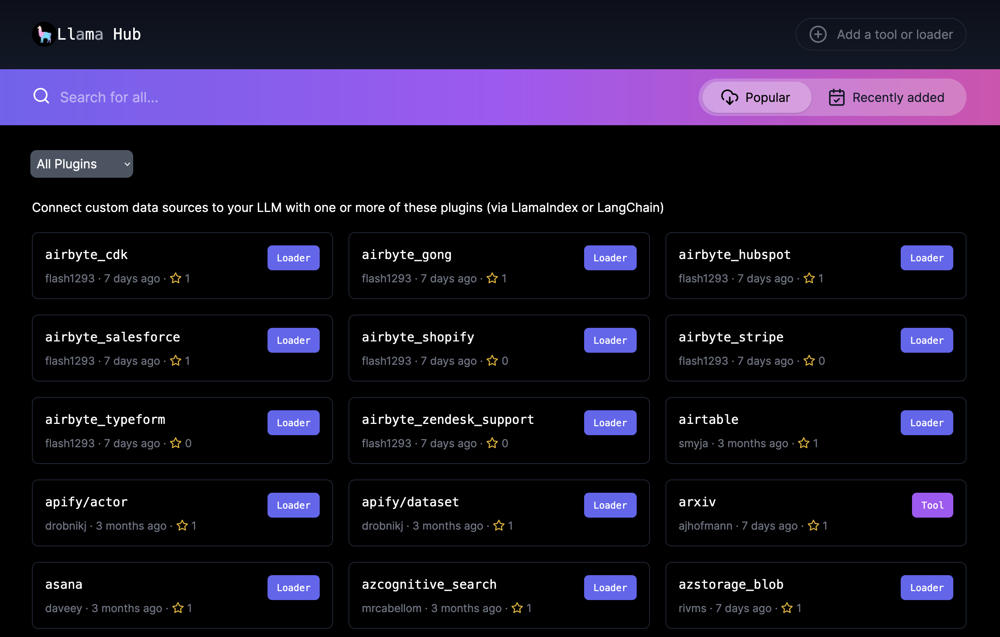

# Data Connectors (数据连接器)

在 `RAG` 的业务场景中，数据加载是非常重要的一个环节。`LlamaIndex` 定义了数据连接器接口，并提供了一系列实现来支持不同的数据源或数据格式的数据加载。它们包括，但不限于：

- Simple Directory Reader
- Psychic Reader
- DeepLake Reader
- Qdrant Reader
- Discord Reader
- MongoDB Reader
- Chroma Reader
- MyScale Reader
- Faiss Reader
- Obsidian Reader
- Slack Reader
- Web Page Reader
- Pinecone Reader
- Mbox Reader
- MilvusReader
- Notion Reader
- Github Repo Reader
- Google Docs Reader
- Database Reader
- Twitter Reader
- Weaviate Reader
- Make Reader

## LlamaHub

`LlamaIndex` 的数据连接器通过 [LlamaHub](https://llamahub.ai/) 提供。`LlamaHub` 是一个开源仓库，包含可轻松集成到任何 `LlamaIndex` 应用。



### 使用示例

#### 使用LlamaIndex框架内置的数据连接器

`LlamaIndex` 框架提供了一系列内置的数据连接器。开发者不需要从 `LlamaHub` 加载就可以直接使用。

以下代码演示了如何读取网页数据。

```python
from llama_index import SummaryIndex, SimpleWebPageReader
documents = SimpleWebPageReader(html_to_text=True).load_data(
    ["http://paulgraham.com/worked.html"]
)
```

#### 从LlamaHub加载数据连接器

以下示例代码从 `LlamaHub` 加载 Markdown 文档数据连接器。关于该数据连接器的细节，请参考[https://llamahub.ai/l/file-markdown](https://llamahub.ai/l/file-markdown)

```python
from pathlib import Path
from llama_index import download_loader

MarkdownReader = download_loader("MarkdownReader")

loader = MarkdownReader()
documents = loader.load_data(file=Path('./README.md'))
```

## 完整实例

对于以上介绍的两种加载方式，请参考完整示例代码[04_Data_Connectors.ipynb](./04_Data_Connectors.ipynb) 
